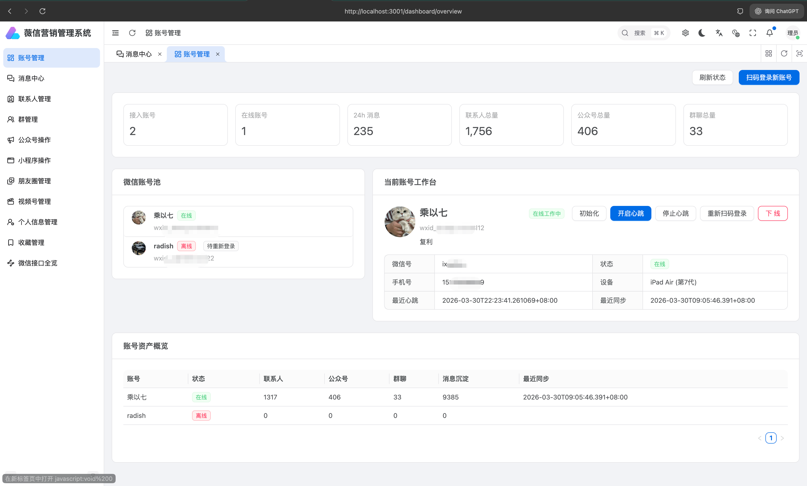
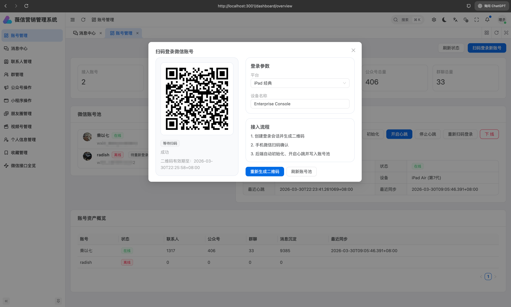
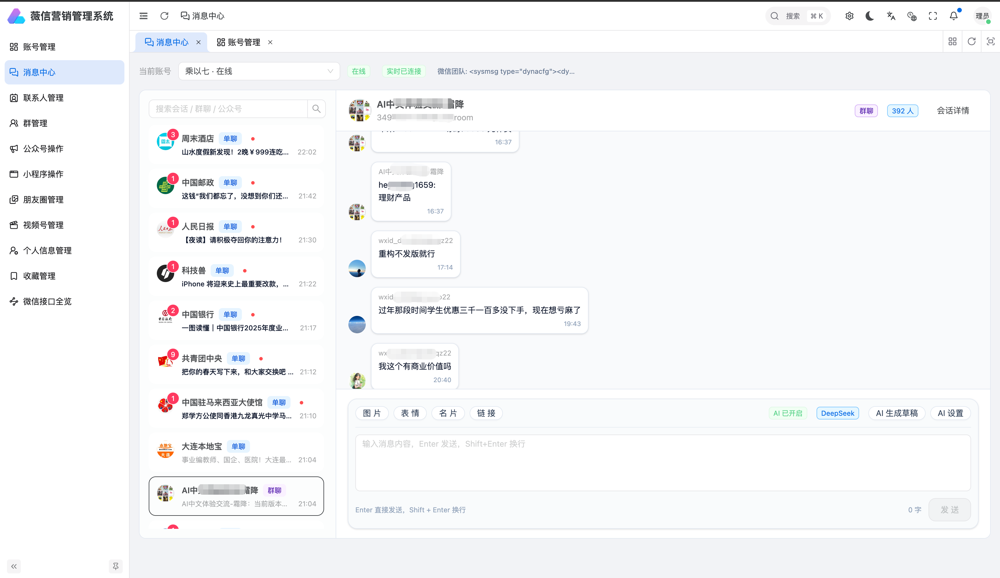
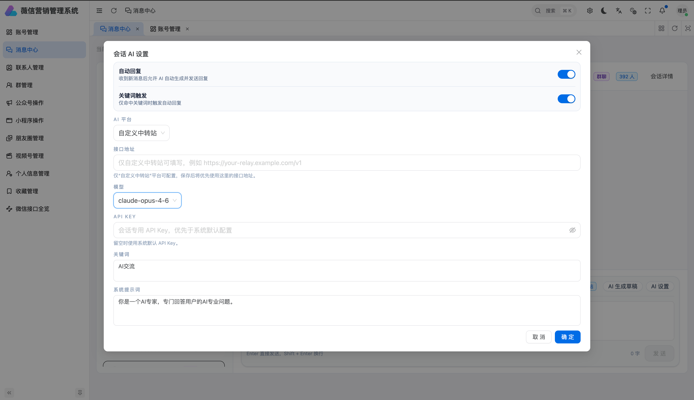
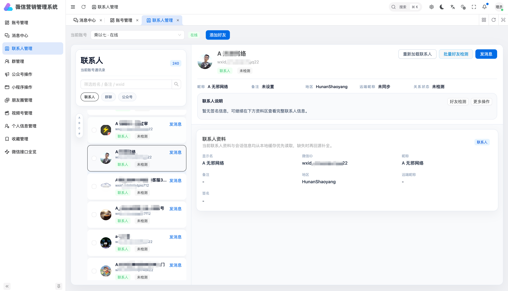
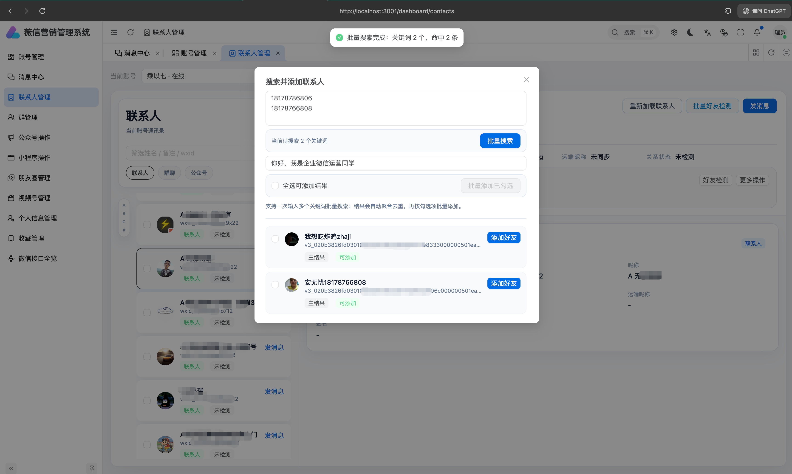
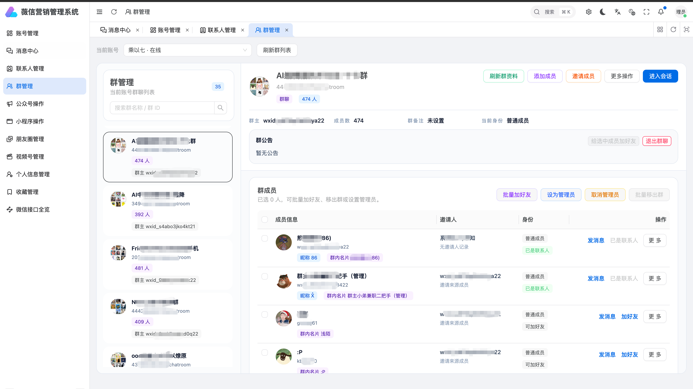
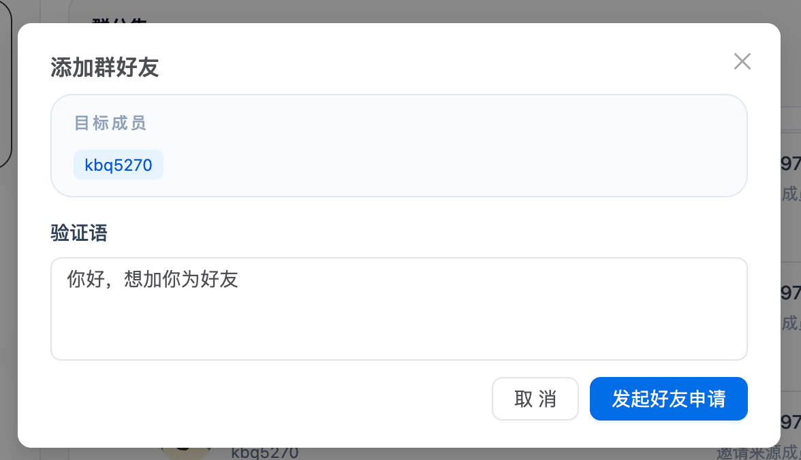
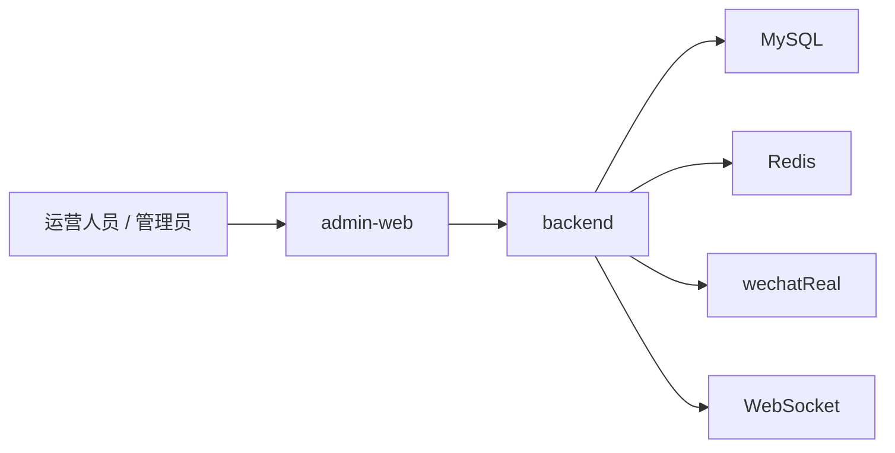

# wechat-scrm-admin

开源微信多账号 SCRM 管理系统，面向私域运营、客服协同和消息留痕场景。项目提供 `admin-web` 管理后台和 `backend` 聚合后端，覆盖多账号接入、消息中心、联系人管理、群管理、AI 辅助回复等核心能力，适合作为企业微信运营后台或微信 SCRM 系统的开发基础。

## 项目简介

`wechat-scrm-admin` 不是单纯的接口调试仓库，而是一套已经整理出后台形态的业务系统骨架。当前项目重点放在以下几个方向:

- 多账号统一接入和状态管理
- 消息会话处理与实时同步
- AI 辅助回复和会话级 AI 配置
- 联系人沉淀、批量加好友
- 群管理、群加好友、群成员整理
- 朋友圈、视频号、收藏等内容资产模块

如果你要做微信 SCRM、私域运营后台、客服工作台，或者需要一个可以继续扩展的开源基础，这个项目比较适合作为起点。

## 核心能力

### 1. 多账号接入

- 微信账号扫码登录
- 唤醒登录
- 初始化与自动心跳
- 在线状态与基础信息查看
- 账号下线与重新接入

### 2. 消息中心

- 会话列表与消息详情
- 实时消息同步
- 文本、图片、表情、名片、链接发送
- 会话级 AI 设置
- AI 生成回复草稿

### 3. 联系人管理

- 联系人 / 群聊 / 公众号分类查看
- 关键词搜索
- 关系检测
- 批量加好友
- 好友拉黑与删除

### 4. 群运营

- 群资料和群成员查看
- 群公告、群名称、群备注修改
- 群成员邀请、移除、管理员设置
- 群加好友
- 群成员整理，便于继续扩展群好友导出流程

### 5. 内容资产

- 收藏管理
- 朋友圈管理
- 视频号资料查看
- 公众号消息浏览

## 功能概览

| 模块 | 当前状态 | 说明 |
| --- | --- | --- |
| 账号管理 | 已可用 | 扫码登录、唤醒登录、初始化、心跳控制、下线、状态总览 |
| 消息中心 | 已可用 | 会话列表、实时同步、文本/图片/表情/名片/链接发送、AI 配置、AI 草稿 |
| 联系人管理 | 已可用 | 联系人列表、搜索、关系检测、批量加好友、拉黑、删除 |
| 群管理 | 已可用 | 群资料、群成员、群公告/名称/备注修改、邀请/移除成员、管理员操作、群加好友 |
| 收藏管理 | 已接入 | 收藏列表、详情查看、删除 |
| 朋友圈管理 | 已接入 | 朋友圈列表、详情、发布、互动操作 |
| 视频号管理 | 已接入 | 视频号资料读取、认证信息与状态展示 |
| 公众号操作 | 已接入基础浏览 | 公众号列表、详情查看、最近消息查看、跳转会话 |
| 小程序操作 | 规划中 | 已整理接口规划页，适合下一阶段继续接入 |

## 页面预览

### 账号管理

统一查看账号状态、消息活跃度、联系人规模，并支持扫码登录、账号唤醒、初始化和下线。





### 消息中心

支持会话处理、消息发送、实时同步和 AI 辅助配置。





### 联系人管理

支持关系检测、批量查询、批量加好友，适合客户资产沉淀和私域运营。





### 群管理

支持群成员查看、群管理操作和群加好友场景。





## 系统架构



### admin-web

前端管理后台，基于 `Vue 3 + TypeScript + Vben Admin + Ant Design Vue`，负责账号管理、消息中心、联系人管理、群管理等运营页面。

### backend

聚合后端，基于 `Go + Gin + GORM`，负责鉴权、登录编排、数据归一化、AI 配置、实时消息同步和业务接口封装。

## 技术栈

### 前端

- Vue 3
- TypeScript
- Vben Admin
- Ant Design Vue
- Vite

### 后端

- Go 1.24
- Gin
- GORM
- MySQL
- Redis
- JWT
- Gorilla WebSocket

### 官网

- Next.js
- React
- Tailwind CSS

## 目录结构

```text
admin-web/       管理后台前端
backend/         聚合后端
marketing-site/  产品官网
pics/            页面截图
wechatReal/      上游微信能力模块
docs/            文档与接口摸底资料
```

## 快速开始

### 1. 启动后端

```bash
cd backend
cp .env.example .env
go run ./cmd/server
```

默认环境:

- MySQL: `root / root123.`
- Redis: `127.0.0.1:6379`，密码 `123456`，DB `2`
- 默认管理员: `admin / admin123456`

### 2. 启动管理后台

```bash
cd admin-web
pnpm install
pnpm dev:antd
```

### 3. 启动官网

```bash
cd marketing-site
pnpm install
pnpm dev --port 3001
```

## 本地访问地址

- 后端健康检查: [http://127.0.0.1:8080/healthz](http://127.0.0.1:8080/healthz)
- 管理后台: [http://127.0.0.1:5173](http://127.0.0.1:5173)
- 产品官网: [http://127.0.0.1:3001](http://127.0.0.1:3001)
- 上游接口服务: [http://127.0.0.1:8062/](http://127.0.0.1:8062/)

> `admin-web` 默认开发端口通常是 `5173`；如果本地环境调整了 `VITE_PORT`，请以终端启动日志为准。

## 主要接口

### 账号与鉴权

- `POST /api/auth/login`
- `GET /api/auth/me`
- `GET /api/dashboard/overview`
- `GET /api/accounts`
- `POST /api/accounts/login-sessions`
- `GET /api/accounts/login-sessions/:sessionId`
- `POST /api/accounts/:wxid/bootstrap`
- `POST /api/accounts/:wxid/heartbeat/start`
- `POST /api/accounts/:wxid/heartbeat/stop`
- `POST /api/accounts/:wxid/logout`

### 联系人与群

- `GET /api/accounts/:wxid/contacts`
- `POST /api/accounts/:wxid/contacts/reload`
- `POST /api/accounts/:wxid/friends/search`
- `POST /api/accounts/:wxid/friends/request`
- `POST /api/accounts/:wxid/friends/request/batch`
- `POST /api/accounts/:wxid/groups/:qid/members/add`
- `POST /api/accounts/:wxid/groups/:qid/members/invite`
- `POST /api/accounts/:wxid/groups/:qid/members/remove`
- `POST /api/accounts/:wxid/groups/:qid/add-friend`

### 会话与 AI

- `GET /api/accounts/:wxid/conversations`
- `GET /api/accounts/:wxid/conversations/:conversationId/messages`
- `POST /api/accounts/:wxid/conversations/:conversationId/messages/text`
- `POST /api/accounts/:wxid/conversations/:conversationId/messages/image`
- `POST /api/accounts/:wxid/conversations/:conversationId/messages/emoji`
- `POST /api/accounts/:wxid/conversations/:conversationId/messages/card`
- `POST /api/accounts/:wxid/conversations/:conversationId/messages/link`
- `GET /api/accounts/:wxid/conversations/:conversationId/ai-setting`
- `PUT /api/accounts/:wxid/conversations/:conversationId/ai-setting`
- `POST /api/accounts/:wxid/conversations/:conversationId/ai-draft`
- `POST /api/accounts/:wxid/messages/sync`
- `GET /ws/:wxid`

## 适合继续扩展的方向

- 群好友导出和客户沉淀流程
- 客户标签、客户画像、跟进记录和线索流转
- 消息归档、检索、审计和质检中心
- AI 知识库回复、质检分析和自动化运营
- 组织架构、权限管理和多角色协同

## 使用说明

- 这个仓库更适合作为企业后台、微信 SCRM、私域运营系统的二开基础
- 项目涉及上游微信相关能力，使用前请自行确认合规边界和平台规则
- 如果继续开发，建议优先从 `admin-web` 和 `backend` 两部分入手

## 免责声明

- 本项目仅用于技术研究、学习交流和合法合规的业务系统开发参考，不提供任何绕过平台规则、规避风控或实施违规操作的能力承诺。
- 本项目与腾讯、微信及其关联公司没有任何官方合作、授权或从属关系，项目中提及的相关产品名称、商标和标识均归其权利人所有。
- 使用者在部署、二次开发、运营或商用本项目时，应自行确认并遵守所在地法律法规、平台协议、数据保护要求、网络安全要求及相关合规义务。
- 任何基于本项目实施的账号控制、消息处理、客户触达、数据采集、群运营、自动化操作或商业化行为，均由实际使用者自行承担责任。
- 如果你计划将本项目用于生产环境、商业系统或面向客户的正式服务，建议在上线前由专业律师或合规团队完成审查。

## 说明

文档中提到的“群好友导出”当前更接近能力方向描述。现有代码已经具备群成员查看、筛选、批量处理和群加好友基础能力，适合在此基础上继续补齐完整导出流程。
